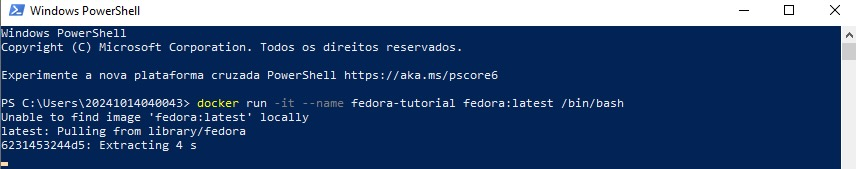
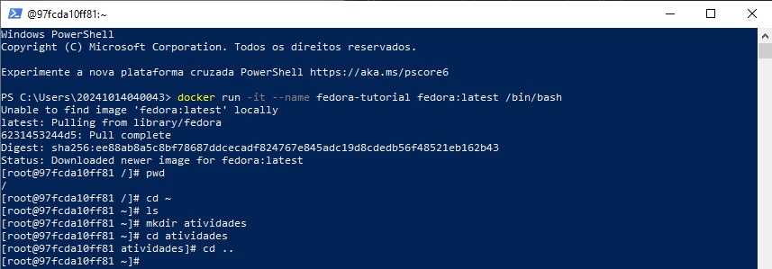
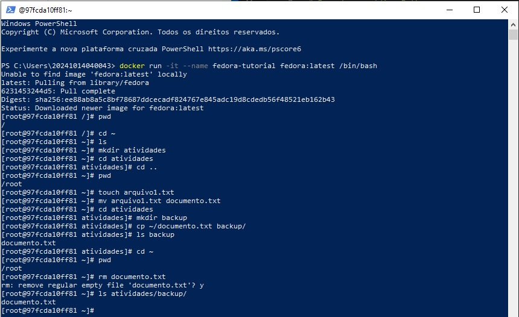
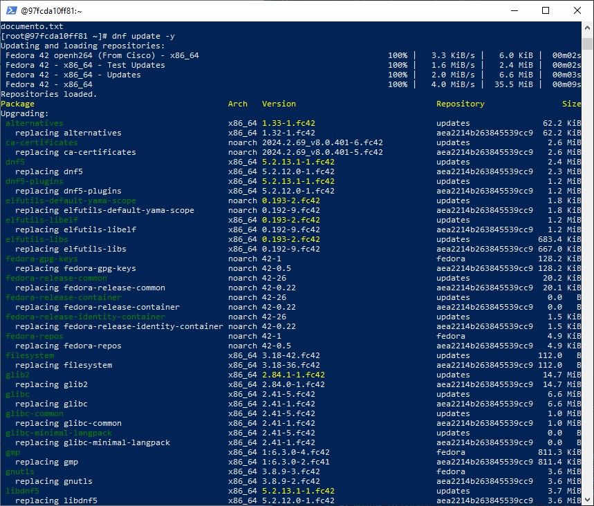
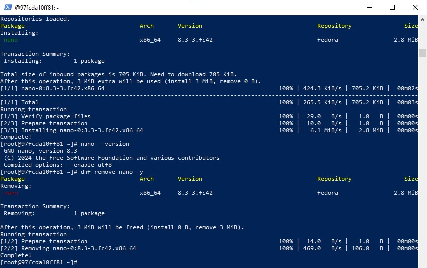
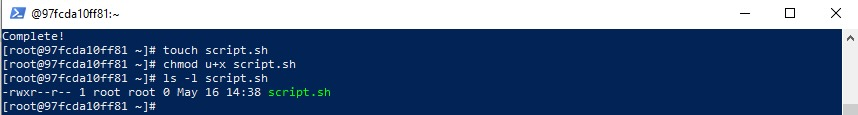
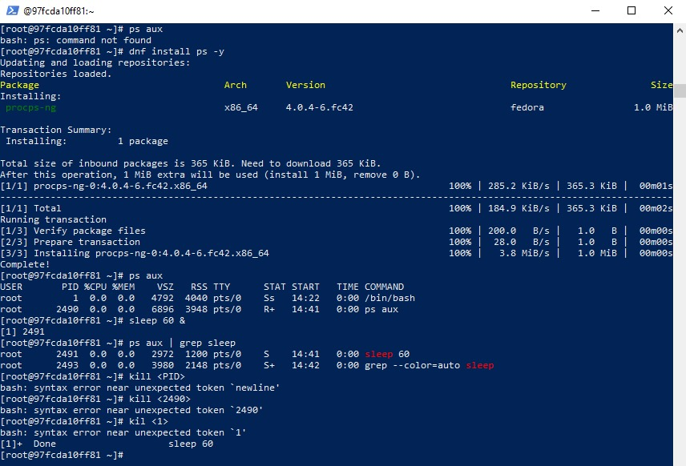
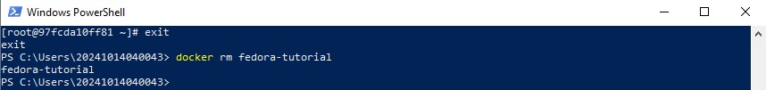

### S.O. 2025.1 - Atividade 02
# **Relatório de Atividades práticas com Linux em um contêiner Docker (Fedora)**
### Aluno: Josephy Cruz Araújo 
### Data: 09/05/2025

## Introdução: 
O objetivo desta atividade foi realizar exercícios práticos com comandos básicos do Linux em um contêiner Docker baseado no Fedora. As tarefas incluíram a criação e manipulação de arquivos e diretórios, instalação e remoção de pacotes, gerenciamento de processos e permissões de arquivos. O relatório documenta os passos executados e os resultados obtidos, acompanhados de imagens das atividades.

## Relato:
### 1. Criação e Configuração do Contêiner Docker: 
Iniciei o exercício executando o comando para criar um contêiner Docker com a imagem do Fedora utilizando Power Shell. A imagem foi baixada e o contêiner foi iniciado com sucesso.

### 2. Navegação básica e criação de diretórios:
Com o contêiner já criado, executei as seguintes operações: 
    - Verifiquei em qual diretório eu estava, utilizando o comando **"pwd"**, e tive como retorno **"/"**, indicando que eu estava no diretório root. 
    - Acessei o diretório home do usuário através do comando **"cd ~"** e execeutei o comando **"ls"** para verificar se haviam pastas e/ou arquivos contidos neste diretório. Como nesse diretório ainda não havia nada armazenado, não foi retornada nada. 
    - Criei uma pasta chamada atividades utilizando o comando **"mkdir"** dentro desse diretório. E usando o comando **"cd atividades"** iniciei a navegação dentro da pasta criada. 
    - Com o comando **"cd .."** retornei ao diretório home

### 3. Manipulação de arquivos: 
Após retornar ao diretório home executei o comando **"pwd"** para me certificar que estava novamente no diretório de origem (home do usuário), e só então dei seguimento com as operações de criação e manipulação de arquivos, como se sucede: 
    - Criei um arquivo .txt chamado "arquivo1" usando o comando **"touch"**. 
    - Em seguida renomeei este arquivo para "documento" usando o comando **"mv"**. 
    - Acessei novamente a pasta atividades com o comando **"cd atividades"** e dentro dela criei outra pasta chamada "backup" utilizando o comando **"mkdir backup"**.
    - Ainda na pasta atividades, criei uma cópia do arquivo "documento.txt" dentro da pasta "backup" através do comando **"cp ~/documento.txt backup/"**. 
    - Executei o comando **"ls backup"** para verificar se o arquivo "documento.txt" encontrava-se armazrnado na pasta "backup" e tive o retorno esperado. 
    - Acessei mais uma vez o diretório home do usuário (comando **"cd ~"**), verifiquei se estava do diretório raiz (comando **"pdw"**), e só então revomi o arquivo original "documento.txt" da home do usuário utilizando o comando **"rm"**. 
    - Por fim, nesta etapa, com o comando **"ls atividades/backup/"** consultei se a cópia do arquivo "documento.txt" se manteve dentro da pasta "backup".

### 4. Instalação e Remoção de Pacotes:
Nesta etapa, inicialmente, realizei a atualização a lista pacotes através do comando **"dnf update -y"**, como mostra a imagem abaixo: 

Em seguida instalei o editor de texto "nano" usando o gerenciador de pacotes "dnf" (comando **"dnf install nano -y"**) e executei os comandos abaixo: 
    - Veriquei se o "nano" foi instalado e em qual versão, com o comando **"nano --version"**.
    - Removi o editor de texto "nano" utilizando o comando **"dnf remove nano -y"**.

### 5. Gerenciamento de permissões: 
Dando continuidade ao exercício, criei um script chamado "script.sh" e alterei suas permissões para torná-lo executável utilizando os seguintes comandos:
    - **"touch script.sh"** para criar o arquivo.
    - **"chmod u+x script.sh"** para conceder a permissão ao dono do arquivo, onde o paramêtro "u" é usado para dar permissão ao dono (usuário) e o "x" para permissão de execução. 
    - E por fim, **"ls -l script.sh"**, para verificar se a permissão está funcionando adequadamente. 

### 6. Gerenciamento de Processos:
Nesta etapa o objetivo foi monitorar e encerrar processos, para isso prodeci da seguinte mameira: 
    - Como o comando ps não estava disponível inicialmente, instalei o pacote necessário utilizando o comando **"dnf install ps"**. O gerenciador de pacotes "dnf" automaticamente resolveu a dependência instalando o pacote "procps-ng", que contém comandos como "ps" e "kill" e é responsável por monitorar e gerenciar processos e sistema. 
    - Após concluir a instalação utilizei o comando **"ps aux"** para listar os processos em execução.
    - Em seguida, com o comando **"sleep 60 &"**, simulei um processo em segundo plano (isso devido a esse parâmetro &). Esse processo teve tipo um temporizador de 60 segundos, e ele seria encerrado automaticamente após esse tempo, mas também poderia ser encerrado manualmente usando o comando "kill". 
    - Através do comando **"ps aux | grep sleep"** encontrei o PID (Process ID) do processos que estavam sendo executados, filtrando apenas as linhas que continham a palavra "sleep". Nesse caso existiam dois processos o "sleep 60" (PID 2491) e o próprio "grep sleep" (2493).  
    - Por fim, tentei encerrar o processo, mas devido a erros na sintaxe ao usar o comando kill, não consegui corretamente o proposto e, devido ao tempo do processo ser apenas 60 segundos, ele encerrou automaticamente (**"Done    sleep 60"**).

### 7. Encerramento do Contêiner
Neste último momento eu saí do contêiner e o removi utilizando os comandos **"exit"** e **"docker rm fedora-tutorial"**, respectivamente. 

## Conclusão: 
Nesta atividade, pratiquei comandos essenciais do Linux em um contêiner Docker com Fedora, incluindo manipulação de arquivos, instalação de pacotes, gerenciamento de processos e permissões. Aprendi a:
    - Criar e gerenciar contêineres Docker.
    - Trabalhar com diretórios e arquivos no Linux. 
    - Instalar e remover pacotes usando dnf.
    - Alterar permissões de arquivos com chmod.

Dificuldades encontradas:
    - Ter tentado executar o comando **"ps aux"** sem antes ter intalado o pacote "procps-ng". Precisei pesquisar sobre o erro para só então descobrir que o pacote não vinha instalado nativamente. 
    - Erros de sintaxe ao usar o comando kill para encerrar processos. Depois entendi que o símbolo < > é usado em tutoriais para indicar que você deve substituir pelo valor real, mas não faz parte do comando e eu deveria ter executado o kill desta forma: **"kill 2491"**.

No geral, a atividade foi enriquecedora e reforçou meu entendimento sobre operações básicas no Linux e Docker.
